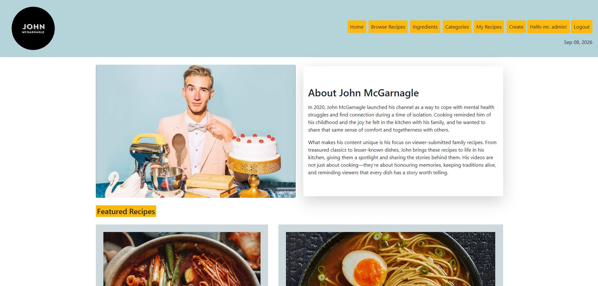
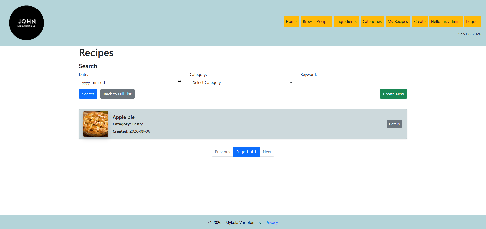
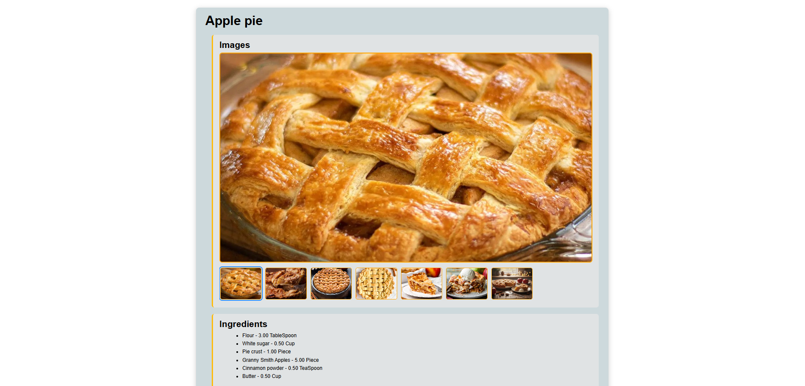
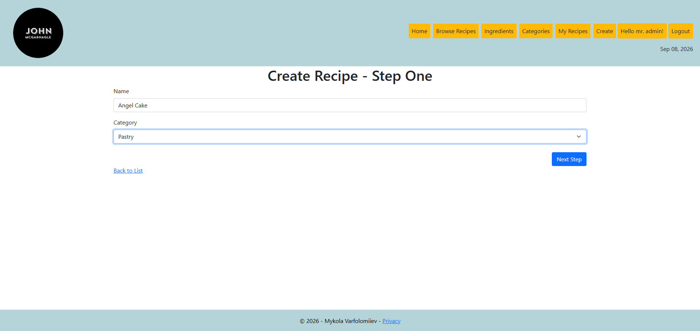
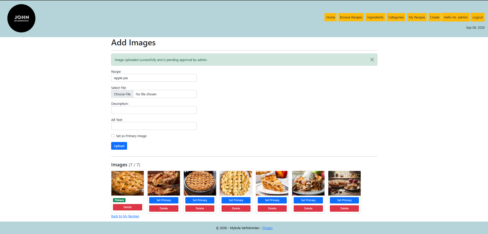
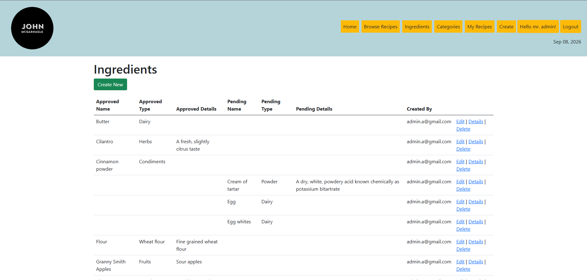
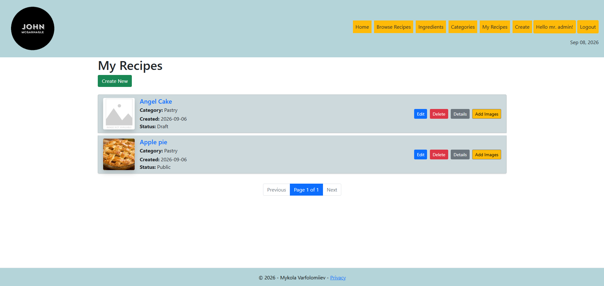

# Recipe Management Web Application

**Tech Stack:** C# | ASP.NET Core MVC | Entity Framework Core | SQL Server |
Azure SQL | ASP.NET Identity | Bootstrap | HTML | CSS | JavaScript

A full-stack recipe management web application built with **ASP.NET Core MVC**.

The application lets users create, manage, and share recipes; search and filter recipes by keyword, category, and date; upload recipe images; manage categories and ingredients; control recipe visibility; and print recipes. It includes user authentication, database integration, image management, and cloud deployment using Microsoft Azure.

## Live Demo

The application is deployed on Microsoft Azure.

**Live Application:** https://mykola-recipe-portfolio-gfb8e3cmdnete8dw.canadacentral-01.azurewebsites.net/
> **Note:** The application may take a few moments to load after a period of inactivity. If it does not load immediately, please wait a moment and refresh the page.

## Screenshots









## Features

- User registration and authentication
- Create, edit, view, and delete recipes
- Recipe ownership — users can manage their own recipes
- Search and filter recipes by keyword, category, date, or a combination of all three
- Print-friendly recipe view for printing or saving recipes as PDF
- Recipe visibility options:
  - Draft
  - Private
  - Public
  - Unlisted
- Ingredient management
- Category management
- Many-to-many relationship between recipes and ingredients
- Ingredient quantities and measurement units
- Upload multiple images for recipes
- Select a primary recipe image
- Image descriptions and alternative text
- Image approval functionality
- Responsive user interface
- Form validation
- SQL database integration
- Entity Framework Core migrations

## Technologies

### Backend
- C#
- ASP.NET Core
- ASP.NET Core MVC
- Entity Framework Core
- ASP.NET Core Identity

### Frontend
- HTML5
- CSS3
- Bootstrap
- Razor Views
- JavaScript

### Database
- Microsoft SQL Server
- Azure SQL Database

### Development & Deployment
- Visual Studio
- Git
- GitHub
- Microsoft Azure

## Application Architecture

The application follows the **Model-View-Controller (MVC)** architecture.

- **Models** represent application and database data.
- **Views** provide the user interface using Razor.
- **Controllers** handle requests and application logic.
- **Entity Framework Core** provides database access and object-relational mapping.
- **ASP.NET Core Identity** handles user authentication and authorization.

## Database

The application uses Entity Framework Core with SQL Server.

Some of the main entities include:

- Recipe
- Ingredient
- RecipeIngredientDetail
- Image
- Application User

`RecipeIngredientDetail` implements the many-to-many relationship between recipes and ingredients and stores information such as ingredient amount and measurement unit.

## Image Management

Users can upload images associated with their recipes.

Image information stored by the application includes:

- File path
- File name
- Description
- Alternative text
- Primary image status
- Approval status
- Creation date

The application supports up to **7 images per recipe**.

## Running the Project Locally

### Requirements

- .NET SDK
- SQL Server / SQL Server Express
- Visual Studio or Visual Studio Code

### 1. Clone the Repository

```bash
git clone YOUR_GITHUB_REPOSITORY_URL
```

### 2. Navigate to the Project

```bash
cd recipe_project_JohnMcGarnagle
```

### 3. Restore Dependencies

```bash
dotnet restore
```

### 4. Configure the Database

Configure the database connection string in `appsettings.json` or through user secrets/environment variables.

> **Important:** Do not commit database credentials or other sensitive configuration values to the repository.

### 5. Apply Database Migrations

```bash
dotnet ef database update
```

### 6. Run the Application

```bash
dotnet run
```

Open the local URL displayed in the terminal.

## Azure Deployment

The application is deployed to Microsoft Azure using:

- Azure App Service
- Azure SQL Database
- Entity Framework Core migrations
- GitHub Actions for CI/CD

## What I Learned

This project gave me hands-on experience with:

- Building a full-stack application with ASP.NET Core MVC
- Designing relational database models
- Working with Entity Framework Core
- Implementing authentication and authorization
- Managing one-to-many and many-to-many relationships
- Handling image uploads
- Implementing CRUD operations
- Form validation
- Database migrations
- Deploying ASP.NET applications and SQL databases to Microsoft Azure
- Using Git and GitHub for source control
- Implementing CI/CD using GitHub Actions

## Author
**Mykola Varfolomiiev**

Full-stack Software Developer
